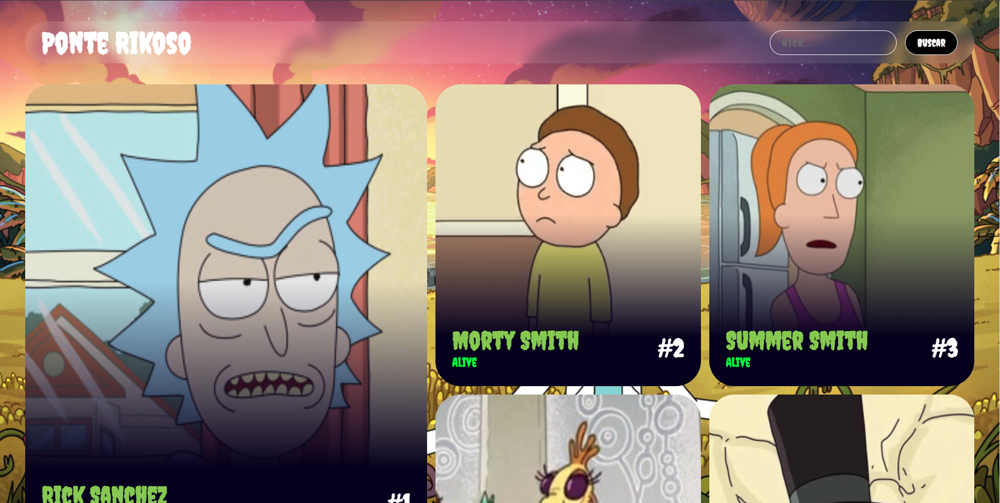

# Rick and Morty Project con Estilo Bento y Glassmorphism


El proyecto Rick y Morty es una aplicación web construida con React y Redux, diseñada para proporcionar información sobre los personajes de la popular serie de televisión.

## Features

- Vea una lista de personajes con detalles como nombre, imagen y estado
- Función de búsqueda para encontrar personajes concretos
- Diseño adaptable para una experiencia de usuario fluida en todos los dispositivos.

## Captura de pantalla



## Demo

Puedes probar aplicación de Rick y Morty App visitando la página de la aplicación [aquí](https://rick-and-morty-nine-inky.vercel.app/).

## Instalación

Para configurar el proyecto localmente, siga estos pasos:

1. Clone el repositorio:

   ```bash
   git clone https://github.com/fernandopanduro/rick-and-morty__bento.git
   ```

2. Navegue hasta el directorio del proyecto:

   ```bash
   cd rick-and-morty__bento
   ```

3. Instale las dependencias del proyecto:

   ```bash
   npm install
   ```

## Uso

Una vez finalizado el proceso de instalación, puede utilizar los siguientes scripts npm para trabajar con el proyecto:

- Inicie el servidor de desarrollo:

  ```bash
  npm run dev
  ```

  Este comando lanza el servidor de desarrollo utilizando Vite, que proporciona un entorno de desarrollo de recarga en caliente. La aplicación será accesible en `http://localhost:5173`.

- Construye el proyecto para producción:

  ```bash
  npm run build
  ```
